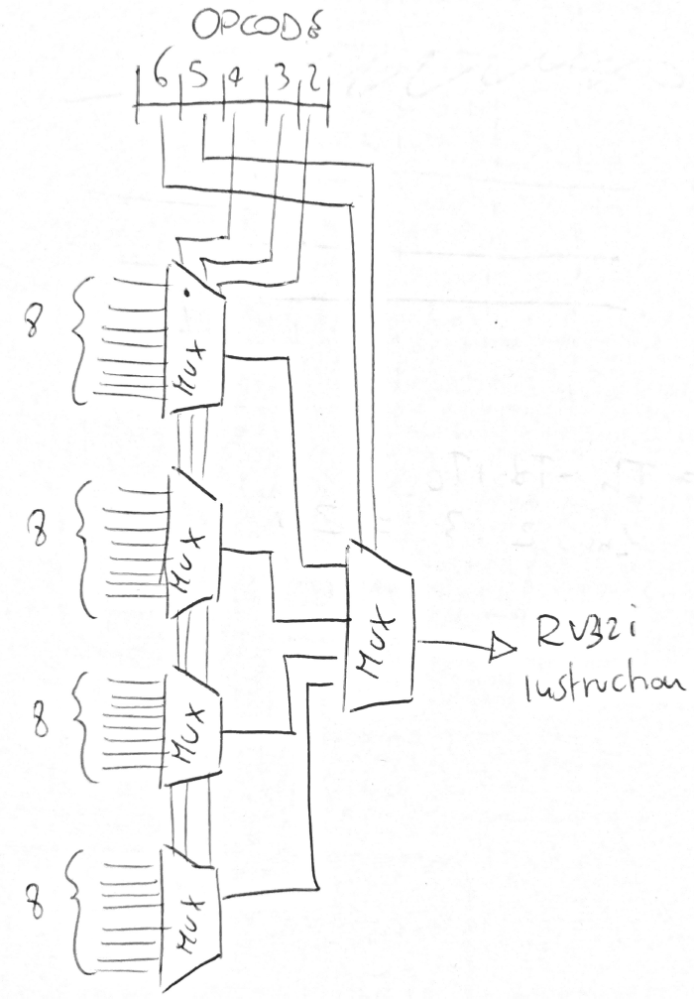

<!-- # nasa-CPU -->


An hobbystic and full of love RISC-V Central Processing Unit.

## Why this Project

I have been working as a researcher in the field of Computer Architecture for several years, developing CPUs and studying them using specific performance simulators (i.e. [gem5](https://www.gem5.org/)). Lately I've come to realize that while I have experience building CPUs at the microarchitectural level, I've never developed a CPU *from scratch* starting from individual digital components.

Driven by the curiosity to build my own CPU from scratch, I bought an amazing book [^1] which sheds light, in a very entertaining way, on the aspects of [High-Level Synthesis](https://en.wikipedia.org/wiki/High-level_synthesis) that I had intended to study and deepen.

This combination of events is perfect since I will be able to build my (hobbystic) CPU in my limited time available starting from a solid foundation such as the one described by Bernand Goossens in the mentioned book.

[^1]: _Guide to Computer Processor Architecture,
A RISC-V Approach, with High-Level Synthesis_ - Bernard Goossens

## Why nasa-CPU

Because the primary purpose of this processor will be to power the spaceships we're going to build in the near future, of course. But also because love leads to silly and funny things.

I'll try to update this git with the progress I'll make in reading the book, time permitting. The code will be, at least initially, very similar (if not the same!) to the one reported by Goossens. However, I hope to add additional features along the way in order to personalize this project.

**_"That's love!"_** 

## Install the RISC-V tools

Working with Ubuntu on WLS2 and bash:

```console
$ sudo apt-get install autoconf automake autotools-dev curl python3 libmpc-dev libmpfr-dev libgmp-dev gawk build-essential bison flex texinfo gperf libtool patchutils bc zlib1g-dev libexpat-dev ninja-build
```

We are going to install the toolchain, the simulator and the kernel proxy in the /opt/riscv with root permissions. 

### RISC-V toolchain:

```console
$ git clone https://github.com/riscv/riscv-gnu-toolchain
$ cd riscv-gnu-toolchain
$ ./configure --prefix=/opt/riscv --enable-multilib --with-arch=rv32i
$ sudo make
```

Add the toolchain path to .profile:

```shellscript
if [ -d "/opt/riscv" ] ; then
    PATH="/opt/riscv/bin:$PATH"
    RISCV="/opt/riscv"
fi
```

### Spike Simulator

Used to simulate the risc-v programs

```console
$ git clone https://github.com/riscv/riscv-isa-sim
$ export RISCV=/opt/riscv
$ cd riscv-isa-sim
$ mkdir build
$ cd build
$ ../configure --prefix=$RISCV --with-isa=rv32i
```

### Kernel proxy for Spike

Used to execute kernel code without having an entire OS running

```console
$ git clone https://github.com/riscv/riscv-pk
$ cd riscv-pk
$ mkdir build
$ cd build
$ ../configure --prefix=$RISCV --host=riscv32-unknown-elf --with-arch=rv32i_zifencei_zicsr
$ make
$ sudo make install
```

## RISC-V ISA Notes

In nasa-CPU I am going to use 32-bit instructions with 32-bit integer data. This is the minimal version of RISC-V ISA (named RV32I) what uses 32 registers, sufficient to run basically any simple possible application written and compiled for this instructions set, even a simple Operating System (OS).

I found [this OS](https://github.com/moratorium08/osmium/) written in Rust using only the RV32IM isa, I will keep an eye on similar projects. 

On top of RV32I I will try to add/build other RISC-V (RV from now on) extensions as exercises, for example:

* *M extension*: for the integer multiplication
* *F extension*: for the floating-point computation
* *E extension*: for embedded systems, basically RV32I but with 16 registers

The full RV Specification is [here](https://riscv.org/technical/specifications/).

### ABI

An instruction set is, at the very end, just a set of rules that hardware and software agreed on. 

#### Registers:

| ISA name | alias | suggested role         | save in stack |
| -------- | ----- | ---------------------- | ------------- |
| x0       | zero  | hardwired to zero      | no            |
| x1       | ra    | **r**eturn address     | yes           |
| x2       | sp    | **s**tack **p**ointer  | no            |
| x3       | gp    | **g**lobal **p**ointer | no            |
| x4       | tp    | **t**hread **p**ointer | no            |
| x5       | t0    | **t**emporary          | no            |
| x6       | t1    | **t**emporary          | no            |
| x7       | t2    | **t**emporary          | no            |
| x8       | s0    | **s**aved              | yes           |
| x9       | s1    | **s**aved              | yes           |
| x10      | a0    | **a**rguments          | no            |
| x11      | a1    | **a**rguments          | no            |
| x12      | a2    | **a**rguments          | no            |
| x13      | a3    | **a**rguments          | no            |
| x14      | a4    | **a**rguments          | no            |
| x15      | a5    | **a**rguments          | no            |
| x16      | a6    | **a**rguments          | no            |
| x17      | a7    | **a**rguments          | no            |
| x18      | s2    | **s**aved              | yes           |
| x19      | s3    | **s**aved              | yes           |
| x20      | s4    | **s**aved              | yes           |
| x21      | s5    | **s**aved              | yes           |
| x22      | s6    | **s**aved              | yes           |
| x23      | s7    | **s**aved              | yes           |
| x24      | s8    | **s**aved              | yes           |
| x25      | s9    | **s**aved              | yes           |
| x26      | s10   | **s**aved              | yes           |
| x27      | s11   | **s**aved              | yes           |
| x28      | t3    | **t**emporary          | no            |
| x29      | t4    | **t**emporary          | no            |
| x30      | t5    | **t**emporary          | no            |
| x31      | t6    | **t**emporary          | no            |

#### Instruction format:

* R-TYPE: Register 
* I-TYPE: Immediate
* U-TYPE: Upper
    * J-TYPE: (variant)
* S-TYPE: Store
    * B-TYPE: (variant)


## High-Level Sythesis Notes

The development board used for the experiments is the [PYNQ-Z2](https://www.xilinx.com/support/university/xup-boards/XUPPYNQ-Z2.html). 

To source the HLS project, run the tcl build script from Vitis HLS console:

```
source nasa-CPU\HLS\fetching_ip\solution1\script.tcl
```

### The Critical Path

This is the simplified exeution loop used for the first version of nasa-CPU.


During _execute_ the new PC counter is calculated so it can be used by the next fetch phase.
The entire loop continues until a specific condition (i.e. the **RET** instruction) is encounted.

#### Testbench

Printing the content of test_op_imm_0_text.hex will return the following output:

```
Generating csim.exe
PC: 0000 -> Instruction: 00500593
PC: 0004 -> Instruction: 00158613
PC: 0008 -> Instruction: 00c67693
PC: 0012 -> Instruction: fff68713
PC: 0016 -> Instruction: 00576793
PC: 0020 -> Instruction: 00c7c813
PC: 0024 -> Instruction: 00d83893
PC: 0028 -> Instruction: 00b83293
PC: 0032 -> Instruction: 01c81313
PC: 0036 -> Instruction: ff632393
PC: 0040 -> Instruction: 7e633e13
PC: 0044 -> Instruction: 01c35e93
PC: 0048 -> Instruction: 41c35f13
PC: 0052 -> Instruction: 00008067
done
```

The synthesis in my run reports: 128 BRAM, 225 Flip-Flops, and 272 LUTs.

Looking at the Schedule Viewers, the instruction fetched is used to check the RET, nothing else.
The Execute only computes the next PC. Lately I will add more useful work.


### HLS Interface

The ``fetching_ip()`` top function uses the [AXI](https://developer.arm.com/documentation/ihi0022/latest/) interface [in HLS](https://docs.xilinx.com/r/en-US/ug1399-vitis-hls/pragma-HLS-interface) for the connection with the "outer world". AXI is a simple and powerful protocol, and this pragma is used to connect the FPGA core with the ARM core, indeed is can be used only by top-level function.

```c
#pragma HLS INTERFACE mode=s_axilite port=<connection name>
```

### Pseudoinstructions used

Official reference [here](https://github.com/riscv-non-isa/riscv-asm-manual/blob/master/riscv-asm.md).

#### RET 

Return from subroutine.

```c++
#define RET               0x8067
```

Base instruction:

```assembly
jalr x0, x1, 0
```

### Exporting the RTL design with Vivado HLS

Vivado HLS seems not really happy about folder names with spaces. Initially I was using "exported RTL" as destination for the implementation export, but it seems despite we live in 2023, it is still very hard to handle folder so named.

The quick workaround/solution was to use 'exported_rtl' to export the RTL from Vivado. The exported file is used to create the actual designe using... Vivado IDE!

## The IP Design on PYNQ-Z2

The board has an Arm core (also named PS or Processing System) and the programmable FPGA that will be programmed with the fetching IP created. Vivado has a nice tool that try to connect automatically the two components according to their interface/setup, AXI included.

This is how the fetching IP looks like after the proper connections:


We use Vivado not only to connect the IP, but also to crate its HDL wrapper and finally the bitstream we are going to move on the FPGA. This is where we program the FPGA.

## Running the exported bitstream on the FPGA

I am using Vitis IDE. A new project is created starting from the XSA (bitstream) generated before. Vitis offers a classic hello_word example useful to test if the board works, the connections are ok and if everything is ready for our *fetching_ip*.

## Decoder

According to the RV32I spec, the 32 instructions are encoded in the 5 bits of the opcode ``INSTRUCTION[2-6]``. Bernard suggest to implement the decoder using 4 mux in cascade for the bits 2-4 , followed bu a mux driven by bits 5 and 6. 



At this stage we don't have much concerns regarding the timing of the two set of multiplexer in cascade, and this approach should be easly optimized by Vivado.